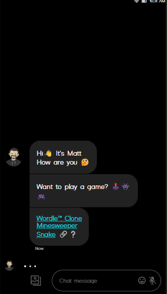
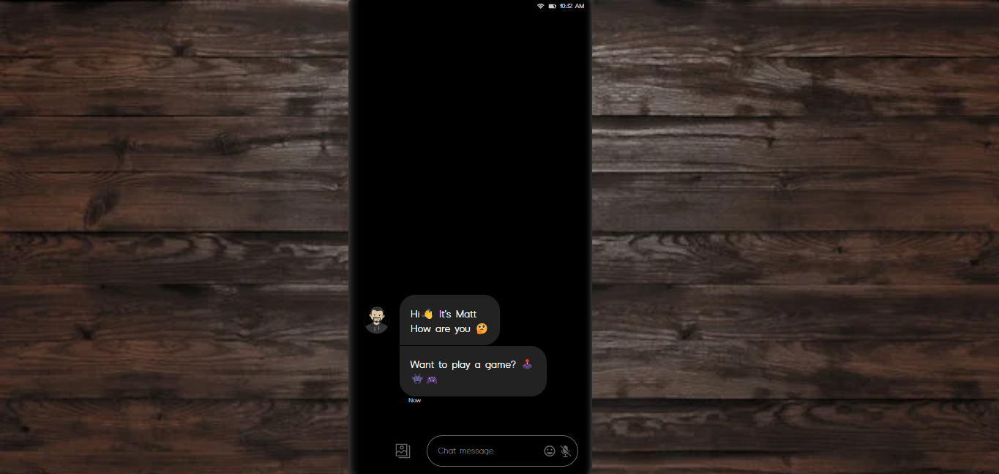
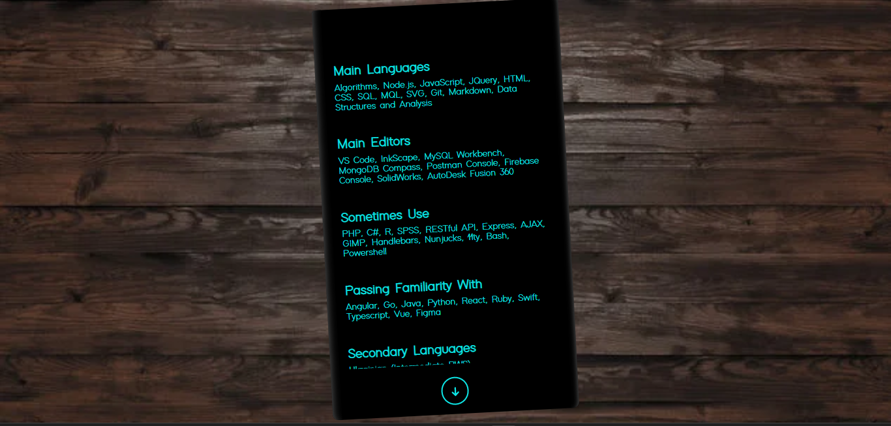

# Personal Website

Deployed [here](https://mlorber.com)

## Description

Personal website in vanilla JS made to resemble a chat session. The avatar shares my details and provides links and minimal interaction in response to user inputs.

## Code Excerpt
* Coded in vanilla JS ES6
```javascript
// SPLICE A RESPONSE INTO AVATAR TEXTS ARRAY IN RESPONSE to USER MESSAGE input event
function reply(x) {
  setTimeout(() => {
    replies.length === 0 ? replies[0] = `*Send me that xxxxx via email`.replace("xxxxx", x) : replies[0] = replies[0].toString().replace("xxxxx", x);
    if (texts.length === 0) setTimeout(message, 2500);
    texts.splice(0, 0, replies[0]);
    replies.splice(0, 1);
  }, 2000);
}
```

## Screenshots

### Mobile


### Desktop


### Stats Page


## License
[CC BY 4.0](https://creativecommons.org/licenses/by/4.0/)